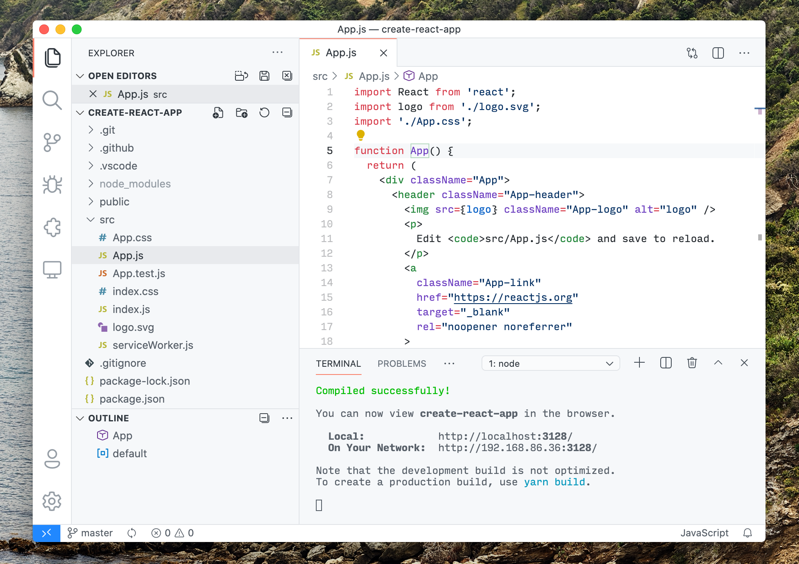

# Fluent Icons

A product icon theme for Visual Studio Code

[Product icons themes](https://code.visualstudio.com/api/extension-guides/product-icon-theme) allow theme authors to customize the icons used in VS Code's built-in views: all icons except file icons (covered by file icon themes) and icons contributed by extensions. This extension uses [Fluent Icons](https://www.figma.com/community/file/836835755999342788/Microsoft-Fluent-System-Icons).

# Install
1. Install the icon theme from the [Marketplace](https://marketplace.visualstudio.com/items?itemName=miguelsolorio.fluent-icons)
2. Open the command palette (`Ctrl/Cmd + Shift + P`) and search for `Preferences: Product Icon Theme`
3. Select `Fluent Icons`
